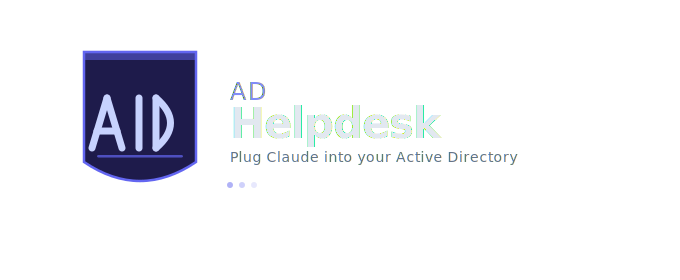

# AD Helpdesk



**Plug Claude into your Active Directory server and manage it with plain English.**

Unlock accounts, reset passwords, create users, move OUs, run bulk operations - all by
talking to Claude in Cowork. No clicking through MMC consoles, no scripting, no expensive
enterprise tooling. Just describe what you need and it happens.

Built for IT admins, homelabbers, and small businesses running Windows Server AD.

---

## What this looks like in practice

> "Find jake.miller, check if his password is expired - if it is, reset it to a random temp password and tell me what it was set to. Also tell me what OU he's in."

Claude looks up the account, checks the status, generates a secure temp password, resets
it in AD, and reports back - all in one shot. No forms, no dashboards, no context switching.

Or go bigger:

> "List every account in the Students OU with an expired password and reset them all to Temp1234!, then give me a summary of what changed."

That's a bulk operation across your entire domain, executed from a single sentence.

---

## How it works

AD Helpdesk runs a lightweight file-based bridge on your PC. Claude writes a command, your
local watcher picks it up, executes it against your AD server via WinRM, and writes the
result back. Claude reads it and responds.

```
You (plain English)
    |
    v
Claude / Cowork
    |  writes cmd.json
    v
watcher.py  (running on your PC)
    |  executes via WinRM
    v
Windows Server 2022 + Active Directory
    |  result.json written back
    v
Claude reports back to you
```

No cloud, no API keys beyond your Cowork subscription, no data leaving your network.
Works across locations via Tailscale - your laptop at home can manage a server at the office.

---

## Operations

| Operation | Natural Language | CLI | API | Dashboard |
|---|---|---|---|---|
| Get user info | "look up sarah.chen" | yes | yes | yes |
| Search users | "find users named Smith" | yes | yes | yes |
| List all users | "show me all accounts" | yes | yes | yes |
| Reset password | "reset jake's password" | yes | yes | yes |
| Unlock account | "unlock john.smith" | yes | yes | yes |
| Enable / disable | "disable sarah's account" | yes | yes | yes |
| Add / remove group | "add mike to IT-Admins" | yes | yes | yes |
| Create user | "create a new IT user for Tom Brady" | yes | yes | yes |
| Move OU | "move test.mcgee to Teachers" | yes | - | - |
| Locked accounts | "who's locked out right now?" | yes | yes | yes |
| Expired passwords | "who has an expired password?" | yes | yes | yes |
| Domain stats | "how many users do we have?" | yes | yes | yes |

Every write operation is logged with a timestamp to `ps-scripts/audit.log`.

---

## Architecture

```
Your Machine (Mac / Linux / Windows)
    |
    |  WinRM over HTTP (port 5985)
    |  NTLM authentication
    v
Windows Server 2022 VM
    |- Active Directory Domain Services
    |- WinRM / PowerShell Remoting enabled
    +- ps-scripts/*.ps1  (executed remotely)
```

Works across networks via **Tailscale** - no VPN or port forwarding required.

---

## Prerequisites

### Your machine
- Python 3.9+
- Network access to the VM (same LAN, or Tailscale)
- Claude Cowork (for natural language mode)

### Windows Server VM
- Windows Server 2019 / 2022
- Active Directory Domain Services installed and promoted
- WinRM enabled (run as Administrator on the VM):

```powershell
Enable-PSRemoting -Force
```

- Service account in Remote Management Users and local Administrators:

```powershell
New-ADUser -Name "Helpdesk Service" -SamAccountName "svc.helpdesk" `
  -AccountPassword (ConvertTo-SecureString "YourPassword" -AsPlainText -Force) `
  -Enabled $true

Add-ADGroupMember -Identity "Remote Management Users" -Members "svc.helpdesk"
net localgroup Administrators "LAB\svc.helpdesk" /add
```

> Note: `Add-LocalGroupMember` does not work reliably on Domain Controllers. Use `net localgroup` instead.

---

## Setup

### 1. Clone the repo

```bash
git clone https://github.com/lachydotmcg/ad-helpdesk.git
cd ad-helpdesk
```

### 2. Install dependencies

```bash
pip install -r requirements.txt
```

### 3. Configure

```bash
cp .env.example .env
```

Edit `.env`:

```
AD_VM_IP=100.x.x.x          # VM's Tailscale IP
AD_DOMAIN=LAB                # NetBIOS name, NOT lab.local
AD_ADMIN_USER=svc.helpdesk
AD_ADMIN_PASS=yourpassword
DASHBOARD_PASSWORD=changeme
API_KEY=changeme
SECRET_KEY=any-long-random-string
```

> AD_DOMAIN must be the NetBIOS name (e.g. LAB), not the FQDN (lab.local). NTLM auth will fail otherwise.

### 4. Test the connection

```bash
python test_connection.py
```

| Error | Fix |
|---|---|
| `credentials were rejected` | Check AD_DOMAIN is the NETBIOS name, not FQDN |
| `Access is denied` | Run: `net localgroup Administrators "LAB\svc.helpdesk" /add` |
| `Connection refused` | Run `Enable-PSRemoting -Force` on the VM; check firewall allows port 5985 |

---

## Natural language mode (Claude / Cowork)

Start the watcher on your PC:

```bash
python watcher.py
```

Then open Cowork and just talk. Claude reads the skill file in `skill/SKILL.md` to understand
all available operations, writes the appropriate command, and handles the result automatically.

Examples of what you can say:
- "Unlock jake.miller"
- "Reset sarah's password to a temp and tell me what it is"
- "Show me everyone with an expired password"
- "Create a new student account for Emma Wilson, username emma.wilson"
- "Move test.mcgee to the Teachers OU"
- "Add mike.chen to the Domain Admins group"
- "Disable all accounts in the Students OU that haven't logged in this year"

The skill file (`skill/SKILL.md`) contains all the instructions Claude needs. See `skill/INSTALL.md`
for setup details.

---

## Web dashboard

For a point-and-click interface, run:

```bash
python app.py
```

Open http://localhost:8888 - login with your DASHBOARD_PASSWORD.

The dashboard includes live user search, status pills (Active / Locked / Disabled / Pwd Expired),
one-click unlock, password reset, group management, create user form, and audit log view.

---

## Cloud agent mode (v0.4+)

For a fully hosted setup where the dashboard lives in the cloud and your server just runs
a lightweight agent, deploy `cloud/app.py` to any cloud platform (Railway, Render, fly.io):

```
cloud/app.py          -- multi-tenant Flask backend
cloud/db.py           -- SQLite database (swap for PostgreSQL in production)
cloud/requirements.txt
cloud/.env.example
```

Then on the machine with WinRM access to your AD server, run the agent instead of watcher.py:

```bash
cp agent-config.example.json agent-config.json
# fill in cloud_url and your tenant_api_key
python agent.py
```

The agent phones home to the cloud, picks up commands, executes them against AD locally,
and posts results back. No inbound ports required. Works behind NAT and across Tailscale.

```
Cloud backend (Railway / Render / VPS)
    |  HTTPS
    v
agent.py (running on customer's PC or server)
    |  WinRM
    v
Windows Server + Active Directory
```

To create a tenant (get an API key), call the admin endpoint:

```bash
curl -X POST https://your-app.railway.app/admin/tenants \
  -H "X-Admin-Key: your-admin-key" \
  -H "Content-Type: application/json" \
  -d '{"name": "Acme Corp"}'
```

---

## REST API

Start the server and authenticate with `X-API-Key: <your key>` on all requests.

```bash
python app.py
```

```
GET  /api/v1/users
GET  /api/v1/user/<username>
POST /api/v1/user/<username>/reset_password    { "password": "..." }
POST /api/v1/user/<username>/unlock
POST /api/v1/user                              { "first": "", "last": "", "username": "", "ou": "" }
```

This makes AD Helpdesk webhookable - point a Zoho, Freshdesk, or any other platform's
webhook at these endpoints to trigger AD operations automatically on events like new employee
onboarding forms.

---

## Audit log

Every operation is appended to `ps-scripts/audit.log`:

```
2024-01-15 09:32:11 | Reset-Password | User=sarah.chen | Status=SUCCESS | Password reset, ChangePasswordAtLogon=True
2024-01-15 09:45:02 | Unlock-Account | User=john.smith | Status=SUCCESS | Account unlocked
2024-01-15 10:01:44 | Create-User    | User=new.user   | Status=FAILED  | User already exists
```

---

## Security

- Credentials live only in `.env` - never hardcoded, never committed
- Use a dedicated service account (`svc.helpdesk`) rather than domain Administrator
- WinRM is HTTP-only - acceptable within a Tailscale tunnel (encrypted end-to-end), not suitable for open internet
- Never expose port 5985 to the internet
- `API_KEY` header protects all REST API endpoints

---

## Roadmap

- [x] v0.1 — Core bridge (WinRM, CLI, PowerShell scripts, audit log, file queue)
- [x] v0.2 — Web dashboard (Flask UI, REST API, live user panel, search, stats)
- [x] v0.3 — Cowork skill for natural language AD management
- [x] v0.4 — Cloud agent, multi-tenant backend, system tray app, setup wizard
- [ ] v0.5 — Hosted dashboard with multi-user auth and per-tenant isolation
- [ ] v0.6 — AI chat interface via Anthropic API
- [ ] v0.7 — Ticketing system with AI auto-resolution
- [ ] v1.0 — Windows Service installer, HTTPS, Stripe billing, demo mode

---

## Contributing

PRs welcome. Please open an issue first for major changes.

---

## License

MIT
