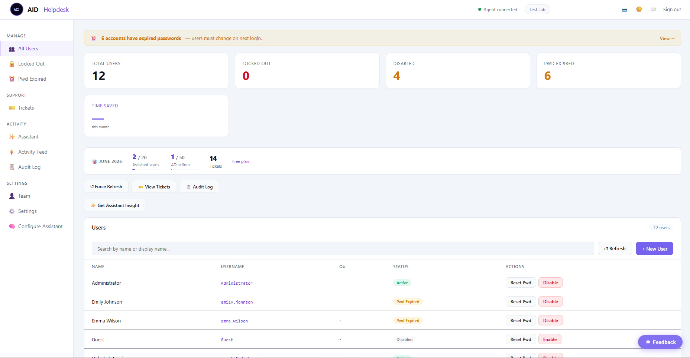
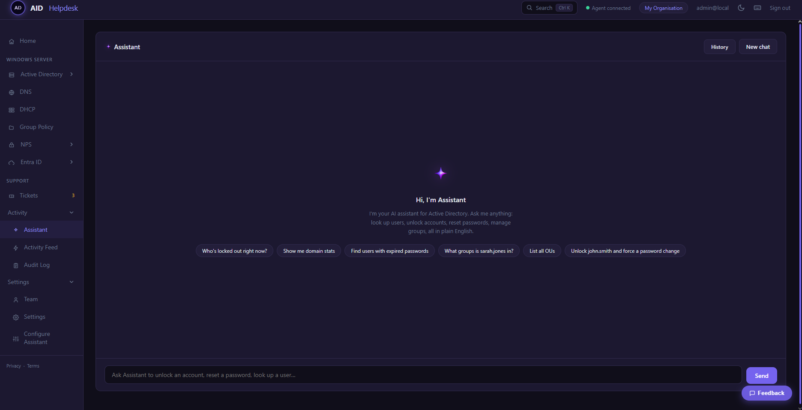
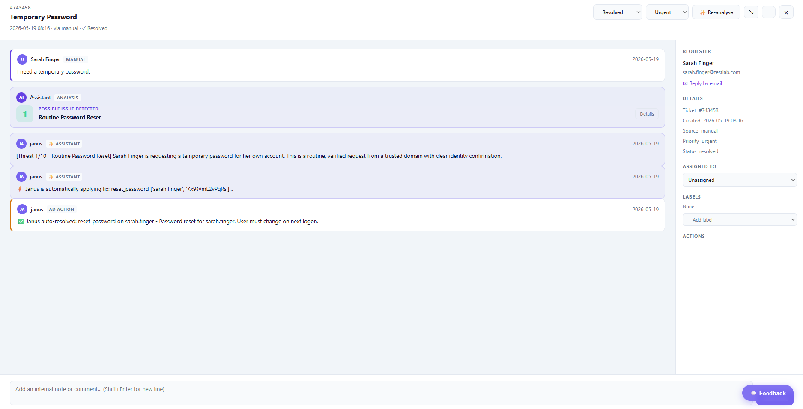

<p align="center">
  
</p>

<h1 align="center">AD Helpdesk</h1>

<p align="center">
  <strong>Run your Windows Server estate in plain English &mdash; self-hosted, with your own AI.</strong><br/>
  Unlock accounts, reset passwords, fix DNS, push apps. No PowerShell, no MMC consoles,<br/>
  no cloud account, and nothing leaves your network.
</p>

<p align="center">
  
  
  
  
</p>

```
> unlock john.smith and reset karen.wilson's password

  On it.  → get_user_info  → unlock_account  → reset_password
  Done. John is unlocked and Karen's temp password has been sent.
```

## Why you might want this

- 🧠 **Bring your own AI.** Point it at [Ollama](https://ollama.com), your own GPU box by IP, or any OpenAI-compatible server (LM Studio, vLLM, LocalAI, Jan, LiteLLM). Pick Local or Cloud in the UI. **No cloud dependency unless you choose one.**
- 🔒 **Your data never leaves.** On-prem dashboard, database, AD, and AI. Full audit trail, secrets encrypted at rest, and every risky action gated behind a confirmation code.
- 🪟 **The whole estate, not just AD.** Active Directory, DNS, DHCP, Group Policy, NPS, app deployment, and Entra ID &mdash; one dashboard, 60 actions.
- 🎫 **Tickets that resolve themselves.** Staff email "I'm locked out"; the assistant verifies who they are, does it, and logs it.
- 🆓 **No plans, no quotas, no billing.** Self-hosted means unlimited.

## Quickstart

```bash
git clone https://github.com/lachydotmcg/ad-helpdesk.git
cd ad-helpdesk && pip install -r requirements.txt

# point it at a local model and run as a single-org install
export AI_PROVIDER=ollama AID_LOCAL_MODE=1
python cloud/app.py
```

Open **http://localhost:5000** &mdash; your admin login is printed to the console on first start.

Then install the agent on a box that can reach your domain controller, and you're live.
Full walkthrough: **[SELF_HOSTING_LOCAL.md](SELF_HOSTING_LOCAL.md)**.

> **Want it managed instead?** The same platform runs as a hosted service at **[aidhelpdesk-bba430f79b62.herokuapp.com](https://aidhelpdesk-bba430f79b62.herokuapp.com)** &mdash; we run it, you just log in.

---

## Screenshots

<p align="center">
  
</p>
<p align="center"><em>Dashboard — live AD user list, domain stats, and one-click actions</em></p>

<br/>

<p align="center">
  
</p>
<p align="center"><em>Assistant — manage Active Directory in plain English</em></p>

<br/>

<p align="center">
  
</p>
<p align="center"><em>Tickets — the AI triages each request, scores threat, and auto-resolves routine ones</em></p>

---

## How it works

Everything below runs on hardware you control. Nothing here requires the internet.

```
  Staff Browser
       │
       ▼
  ┌──────────────────────────────────┐        ┌──────────────────────────┐
  │   AD Helpdesk Dashboard          │ ─────► │  Your AI                 │
  │   (your server / VM / NAS)       │        │  Ollama, LM Studio, vLLM │
  └──────────────┬───────────────────┘        │  or any OpenAI-compatible│
                 │                            │  endpoint by IP/URL      │
                 │  outbound polling          └──────────────────────────┘
                 │  ◀── no inbound ports · no VPN · no firewall rules
                 ▼
  ┌──────────────────────────────────┐
  │   AD Agent                       │  ← Windows Service on your server
  │   (agent.py)                     │
  └──────────────┬───────────────────┘
                 │
                 │  WinRM over HTTPS (TLS · port 5986 · local network only)
                 ▼
  ┌──────────────────────────────────┐
  │   Windows Server                 │
  │   AD · DNS · DHCP · GPO · NPS    │  ← never touches the internet
  └──────────────────────────────────┘
```

The **agent** is a lightweight Windows Service that polls *outbound*; your domain controller never exposes itself, no firewall rules are needed, and it works behind NAT, Tailscale, or any network topology.

---

## The two pieces

AD Helpdesk ships as two components. Run the server anywhere; run the agent next to your domain controller.

| | What it does | Runs on |
|---|---|---|
| **Server** (`aid-server`) | Dashboard, database, AI assistant | Anything with Python: Linux box, VM, NAS, Docker |
| **Agent** (`aid-agent`) | Executes AD/DNS/DHCP/GPO/NPS commands over WinRM | A domain-joined Windows box |

The agent polls the server **outbound**, so your domain controller needs no inbound ports, no VPN, and no firewall changes.

### Connecting the agent

1. **Grab the agent key** &mdash; printed to the console on first start, and shown under **Settings &rarr; Windows Agent**. It is a shared secret that proves the agent belongs to this install, so treat it like a password.
2. **Run the installer** on the Windows box &mdash; `aid-agent-setup.exe` walks through three screens:
   - **Server**: the agent key and your server's address (e.g. `http://192.168.1.20:5000`); the wizard verifies connectivity
   - **AD Credentials**: your AD server IP, domain name, and service account
   - **Install**: writes `agent-config.json` and registers the agent as a Windows Service
3. **Check the dashboard** &mdash; it shows **Agent: Online** and you're live.

> **No installer needed?** Copy `agent-config.example.json` to `agent-config.json`, fill it in, and run `python agent.py`.
> **Build the installer yourself:** `installer/build.bat` (needs Python 3.9+ and PyInstaller on Windows).

---

## Features

### Your own named AI assistant
Give your AI a name that fits your organisation: "Max", "Alex", or whatever your team will actually use. It's not a generic chatbot; it's your organisation's AI, with its own name, its own understanding of your environment, and its own growing memory of how your AD is structured.

### AI that learns your environment
Your AI assistant builds institutional knowledge over time: username patterns, OU structure, team naming conventions, recurring requests. The longer you use AID Helpdesk, the more it understands about your specific environment without you having to explain it every time. It's the IT brain that never forgets.

### Smart ticketing
Staff submit tickets in plain English. Your AI reads the request, checks the requester's identity against your AD domain, assigns a threat score (1-10), flags anything suspicious, and either resolves it automatically or surfaces it for admin review with a full analysis and recommended action.

### AI chat
Talk to your AI directly in plain English to manage your AD. It chains lookups automatically; if it needs to find a group before adding a user, it does both in one step without asking you to repeat yourself.

### Auto-actions
Unlock accounts, reset passwords, enable accounts, hands-free, without waiting for an admin to click approve. Every action is logged.

### Windows Server management, not just AD
Dedicated dashboard tabs for DNS (zones and records), DHCP (scopes, leases, reservations), and Group Policy (GPO list, reports, link map). Reads run freely; routine writes go through the same confirm flow as a password reset, and high blast radius changes (zone or scope deletes, GPO link/unlink) require a human-confirmed 6-digit token before anything runs. NPS (RADIUS) is read-only for now: RADIUS clients, network policies, and connection request policies, all visible from the dashboard.

### Entra ID via Microsoft Graph
Manage cloud users and groups straight from the dashboard, with per-tenant app registration credentials. AID is hybrid-aware: if a user is synced from on-prem AD, mutations are routed to your Windows agent instead of Graph, and the dashboard tells you so, so you're never editing the wrong copy of a user.

### Email ticket intake
Point a Mailgun, SendGrid, or Postmark webhook at your dashboard and tickets flow in from email. Your AI sends the resolution back to the requester automatically.

### Zoho Desk integration
Already running a helpdesk in Zoho Desk? Fire a Zoho webhook at `/webhook/zoho/<your-api-key>` (Setup → Automation → Webhooks, on ticket creation) and Zoho tickets land in AID with full AI analysis and auto-resolution. Repeated webhook events are de-duplicated by Zoho ticket id.

### Scheduled reports
Automated HTML email reports on a schedule you set: daily, weekly, or monthly.

### Full audit trail
Every action (who requested it, what the AI decided, what was executed) is timestamped, searchable, and exportable to CSV.

---

## Audit log

Every AD action produces a structured, immutable log entry:

```
2025-11-03 08:42:17 UTC  requester=sarah.jones@school.edu  action=unlock_account   target=CN=Tom Brady,OU=Staff,DC=lab,DC=local       approval=ai-auto (confidence 0.96)       executor=svc.helpdesk@lab.local
2025-11-03 08:59:04 UTC  requester=admin@school.edu        action=reset_password   target=CN=Jake Miller,OU=Students,DC=lab,DC=local   approval=ai-auto (confidence 0.91)       executor=svc.helpdesk@lab.local
2025-11-03 09:14:38 UTC  requester=admin@school.edu        action=disable_account  target=CN=Ex Teacher,OU=Staff,DC=lab,DC=local       approval=human-confirmed (token 482016)  executor=svc.helpdesk@lab.local
```

High-blast, hard-to-reverse actions (`disable_account`, bulk OU moves, OU creation) require a human-confirmed 6-digit token. Routine helpdesk operations (password resets, unlocks, group changes) are confirmed through the ticket or chat flow and run without an extra prompt.

---

## Self-hosted vs managed

Same platform, same features. The only difference is who runs it and where the AI lives.

| | **Self-hosted** (this repo) | **Managed** ([hosted](https://aidhelpdesk-bba430f79b62.herokuapp.com)) |
|---|---|---|
| AI | Yours: Ollama, your GPU box, any endpoint | Managed model, zero setup |
| AI scans / AD actions | **Unlimited** | Plan quotas |
| Data location | Entirely your network | Hosted |
| Setup | You run it | Sign up and go |
| Updates | `git pull` | Automatic |
| Every feature (AD, DNS, DHCP, GPO, NPS, Entra, deploy, tickets, audit) | ✓ | ✓ |
| Price | **Free** | Paid |

Self-hosting is free and unmetered, forever. The managed service exists purely so you don't have to run it yourself.

> Feedback shapes where this goes next &mdash; use the in-app **Feedback** button or email [lachyswebdev@gmail.com](mailto:lachyswebdev@gmail.com).

---

## Documentation

| | |
|---|---|
| **[SELF_HOSTING_LOCAL.md](SELF_HOSTING_LOCAL.md)** | **Start here** &mdash; run everything locally with your own AI |
| [SECURITY.md](SECURITY.md) | AI safety model, trust architecture, WinRM security, audit logging |
| [ARCHITECTURE.md](ARCHITECTURE.md) | System design, polling model, action flow, DB schema |
| [DEPLOYMENT.md](DEPLOYMENT.md) | Environment variables, PostgreSQL, hosting it on a VPS |
| [docs/deploy-app-design.md](docs/deploy-app-design.md) | How app deployment via Group Policy works |

---

## Roadmap

- [x] v0.1-v0.4: WinRM bridge, dashboard, agent, backend
- [x] v0.5-v0.9: AI assistant, ticketing, threat scores, email intake, search chaining
- [x] v1.0: Windows Service installer (.exe), scheduled reports, custom PS scripts, bulk AD ops
- [x] v1.2: Windows Server management (DNS, DHCP, Group Policy with token-gated writes, NPS), Entra ID via Graph with hybrid routing
- [x] v1.3: Self-hosted edition &mdash; bring-your-own AI (Ollama / any OpenAI-compatible endpoint), local mode, app deployment via GPO
- [ ] v1.4: Named AI persona, organisational memory, Slack/Teams integration

---

## Contributing

PRs welcome, especially on the bridges, PowerShell scripts, and local-model support. Please open an issue first for major changes.

Adding support for another Windows role is deliberately easy: drop a `<role>_bridge.py` next to the others exposing `ACTIONS` and `CAPABILITY`, and the agent auto-registers it. See [ARCHITECTURE.md](ARCHITECTURE.md).

---

## Licence

**Agent + bridges** (`agent.py`, `*_bridge.py`, scripts): [MIT](https://opensource.org/licenses/MIT)

**Backend** (`cloud/`): MIT + [Commons Clause](https://commonsclause.com/) &mdash; self-host freely (including commercially, inside your own organisation); do not resell it as a competing hosted service without a commercial agreement. Contact [lachyswebdev@gmail.com](mailto:lachyswebdev@gmail.com).
